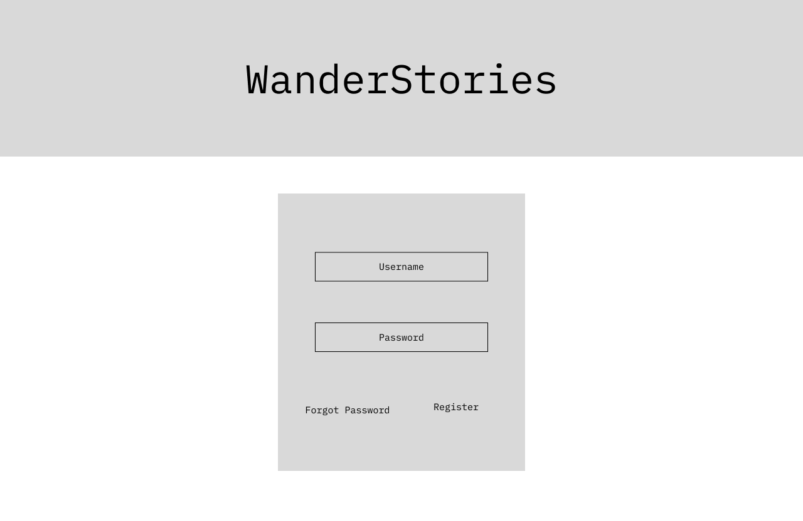
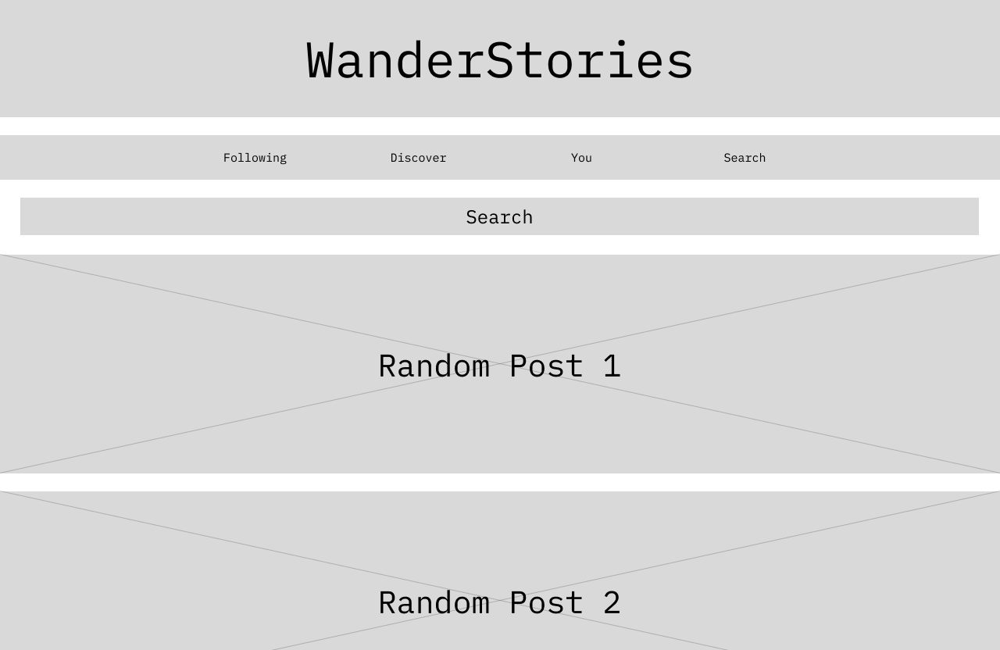
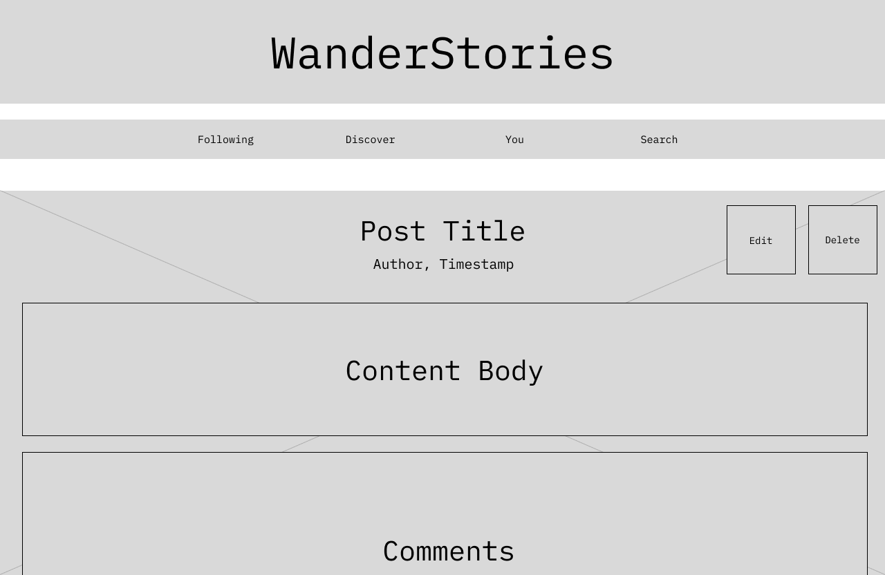
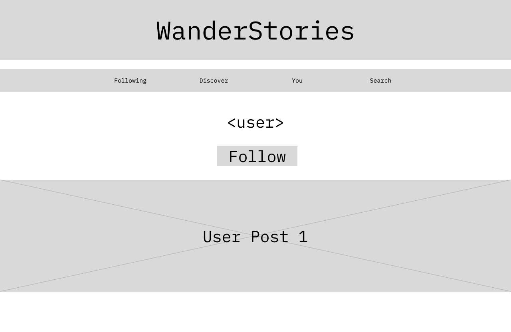
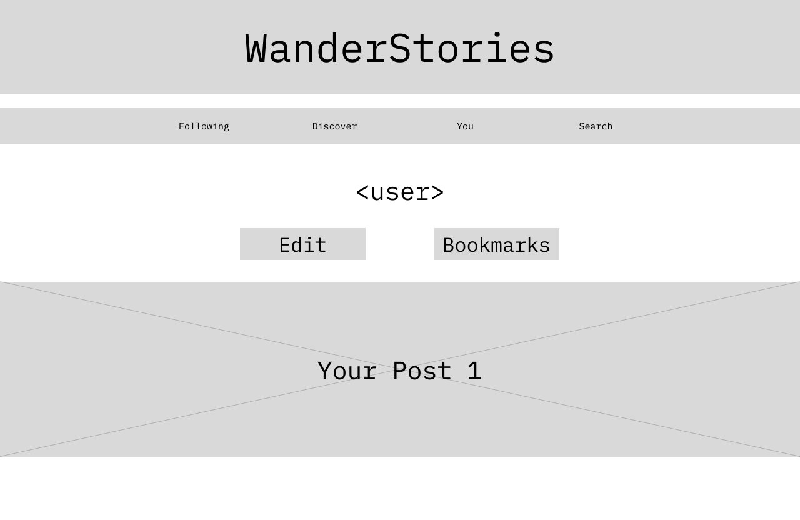
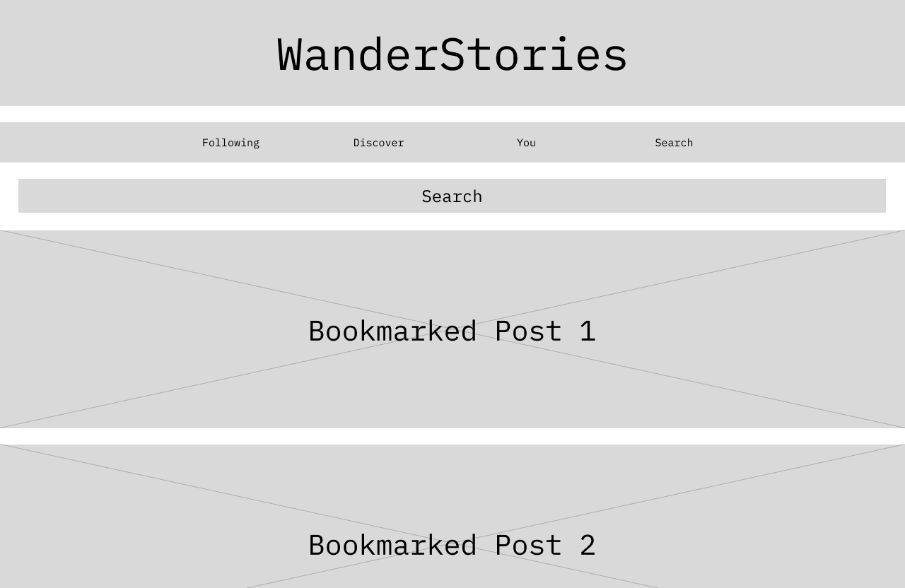
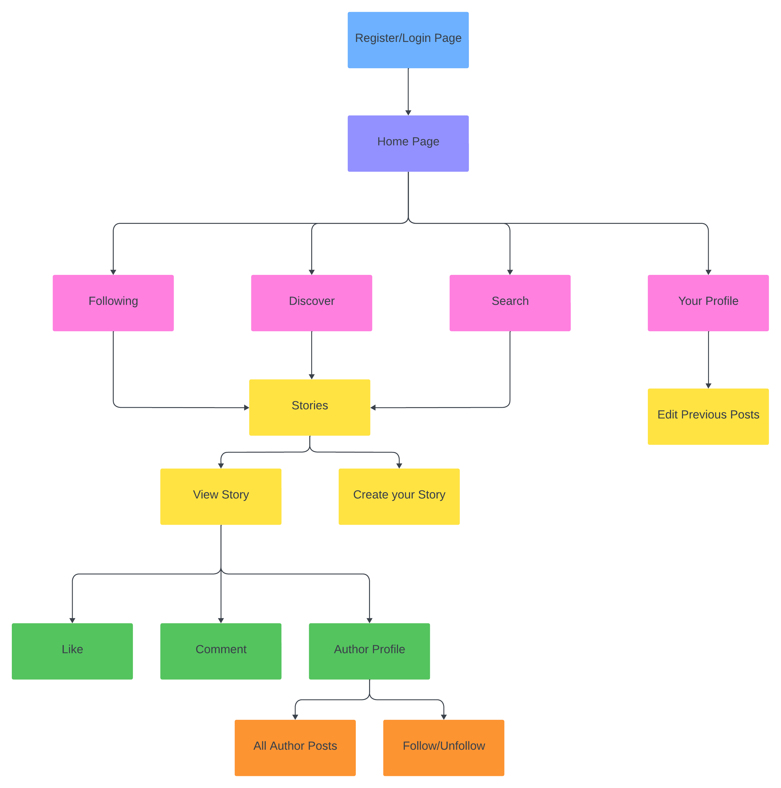

# WanderStories

## Overview

WanderStories is a platform designed to inspire, connect, and celebrate the spirit of travel. WanderStories empowers users to share their unique travel experiences by posting captivating travel stories in their profiles while providing an immersive space to discover, connect with, and learn from each other's journeys.

WanderStory provides users with a user-friendly experience, starting with secure account creation and login. Once logged in, they can seamlessly access an array of features, including the ability to peruse travel stories contributed by fellow community members and post their own adventures. Users have full control over their content, with the option to edit or delete their previously shared stories. Additionally, the platform offers a user search feature, allowing individuals to discover and explore posts authored by specific users and bookmark posts that they enjoy.

## Data Model

WanderStories's data model revolves around two central entities: Users and Stories.

* Users can create multiple stories.
* Users can follow multiple other users.
* Each story can be bookmarked, liked, or commented on by multiple users. 


**An Example User**

```javascript
{
  username: "based_traveller",
  hash: "hashed_password",
  stories: ["story_id_1", "story_id_2", "story_id_3"], // array of references to Story documents
  following: ["user_id_1", "user_id_2"] // array of references to users followed by the user
  bookmarks: ["bookmark_id_1", "bookmark_id_2"] // array of references to bookmarked Story documents
}
```

**An Example Story with Embedded Comments**

```javascript
{
  title: "A Journey to the Amazon Rainforest",
  story_text: "Incredible adventure in the Amazon rainforest...",
  images: ["image_id_1", "image_id_2"],
  location: "Amazon Rainforest",
  created_at: "2023-10-15T08:30:00Z", //timestamp
  author: "based_traveller"
  likes: ["user_id_1", "user_id_1"] // array of references to users that have liked the story
  comments: [ // array of comments left by other users on the post
    {user_id: "user_id_1", comment_body: "Lovely post!"},
    {user_id: "user_id_2", comment_body: "Low quality post."}
  ]
}
```

## [Link to Commented First Draft Schema](db.mjs) 

## Wireframes

/login or /register page for creating account or registering


/home page for showing newest posts


/user/slug for showing another user's story


/user/slug for showing user's own story


/user for showing another user's profile


/user for showing user's own profile


/bookmarks for showing user's bookmarks


## Site map



## User Stories

| As a                    | I want                                                      | so that                                                        |
|-------------------------|-------------------------------------------------------------|----------------------------------------------------------------|
| traveler                | to create and share my travel stories                       | I can inspire and connect with fellow adventurers.             |
| reader                  | to explore a variety of travel stories from different users | I can discover new destinations and experiences.               |
| user                    | to like and comment on stories                              | I can engage with and appreciate the content shared by others. |
| aspiring globetrotter   | to bookmark my favorite travel stories                      | I can revisit them and plan future trips.                      |
| travel blogger          | to edit my published stories                                | I can update them with new information and experiences.        |
| user                    | to follow other travellers whose stories I enjoy               | I can stay updated on their adventures.                        |
| passionate photographer | to easily upload images with my travel stories                 | I can visually narrate my journeys                             |

## Research Topics

Certainly, here's the information presented in the requested format:

**React.js**
- __What is it?__ React.js is a JavaScript library for building user interfaces. It allows you to create reusable UI components, making it easier to manage complex UIs.
- __Why use it?__ I want to use React.js for my web app's frontend to create a responsive, dynamic, and efficient user interface. It simplifies UI development and promotes a component-based architecture.
- __List of possible candidate modules or solutions:__ Redux, React Router, Axios, Redux-Saga.
- __Points for research topic:__ 5 points

**React-Markdown or Draft.js**
- __What is it?__ React-Markdown and Draft.js are libraries for enabling users to write formatted content. React-Markdown parses and displays Markdown content, while Draft.js provides a rich text editor.
- __Why use it?__ These libraries enhance user interaction by allowing the creation of well-formatted travel stories and comments in your app.
- __List of possible candidate modules or solutions:__ React-Markdown, Draft.js, Markdown editor plugins.
- *Points for research topic:* 4 points

**TailwindCSS**
- __What is it?__ TailwindCSS is a utility-first CSS framework. It offers pre-defined CSS classes that make it easy to style your web app without writing custom CSS from scratch.
- __Why use it?__ Use TailwindCSS to streamline and speed up the process of styling your web app. It promotes consistency in design and is highly customizable.
- __List of possible candidate modules or solutions:__ CSS frameworks, like Bootstrap or Material-UI.
- __Points for research topic:__ 1 point

**Google Maps API**
- __What is it?__ The Google Maps API provides tools for integrating interactive maps and location-based services into your web app.
- __Why use it?__ Incorporating the Google Maps API allows you to enhance user experiences with interactive maps, geolocation, and location-based features.
- __List of possible candidate modules or solutions:__ Mapbox, Leaflet, OpenStreetMap.
- __Points for research topic:__ 1 point

## [Link to Initial Main Project File](app.mjs) 

## Annotations / References Used

* [React Documentation](https://devdocs.io/react/)
* [React Markdown](https://www.npmjs.com/package/react-markdown)
* [TailwindCSS Documentation](https://v2.tailwindcss.com/docs)
* [Google Maps API](https://developers.google.com/maps)

